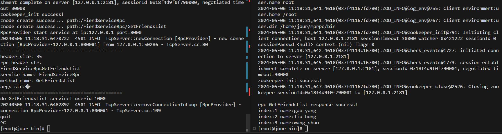

# C++实现分布式网络通信框架项目

## 项目基于muduo高性能网络库+Protobuf开发

## 技术栈

### 1. RPC远程过程调用原理以及实现
### 2. Protobuf数据序列化和反序列化协议
### 3. 使用 Zookeeper 实现该 RPC 框架的服务注册、服务发现功能
### 4. muduo网络库的应用
### 5. 双缓冲区异步日志系统

#
## 集群和分布式

### 集群：每一台服务器独立运行一个工程的所有模块。
### 分布式：一个工程拆分了很多模块，每一个模块独立部署运行在一个服务器主机上，所有服务器协同工作共同提供服务，每一台服务器称作分布式的一个节点，根据节点的并发要求，对一个节点可以再做节点模块集群部署
#

## 环境的配置
### vscode远程连接linux进行开发，开发前安装protobuf、zookeeper、muduo网络库、cmake-3.4、 gcc-11.2.0
#

## linux下搭建muduo网络库
### muduo库的安装需要依赖boost库，具体安装配置步骤参考博客：
https://blog.csdn.net/QIANGWEIYUAN/article/details/89023980

## Protobuf安装配置
### protobuf（protocol buffer）是google 的一种数据交换的格式，它独立于平台语言。
google 提供了protobuf多种语言的实现：java、c#、c++、go 和 python，每一种实现都包含了相应语
言的编译器以及库文件。
由于它是一种二进制的格式，比使用 xml（20倍） 、json（10倍）进行数据交换快许多。可以把它用
于分布式应用之间的数据通信或者异构环境下的数据交换。作为一种效率和兼容性都很优秀的二进制数
据传输格式，可以用于诸如网络传输、配置文件、数据存储等诸多领域

## ubuntu protobuf环境搭建
### 在github源代码下载地址：https://github.com/google/protobuf
源码包中的src/README.md，有详细的安装说明，安装过程如下：
### 1、解压压缩包：unzip protobuf-master.zip
### 2、进入解压后的文件夹：cd protobuf-master
### 3、安装所需工具：sudo apt-get install autoconf automake libtool、curl make g++ unzip
### 4、自动生成configure配置文件：./autogen.sh
### 5、配置环境：./configure
### 6、编译源代码(时间比较长)：make
### 7、安装：sudo make install
### 8、刷新动态库：sudo ldconfig

#
## zookeeper安装
### 下载 zookeeper-3.4.10.tar.gz，解压后
### 1、zookeeper-3.4.10$ cd conf 
### zookeeper-3.4.10/conf$ mv zoo_sample.cfg zoo.cfg
### 2、进入bin目录，启动zkServer， ./zkServer.sh start
### 3、可以通过netstat查看zkServer的端口，在bin目录启动zkClient.sh链接zkServer，熟悉zookeeper怎么组织节点
#

## 项目文档说明
### bin：可执行文件
### build：项目编译文件
### lib：项目库文件
### src：源文件
### test：测试代码
### example：框架代码使用范例
### CMakeLists.txt：顶层的cmake文件
### README.md：项目自述文件
### autobuild.sh：一键编译脚本

##
## 项目架构图

## 测试（记得先打开zookeeper服务端）

